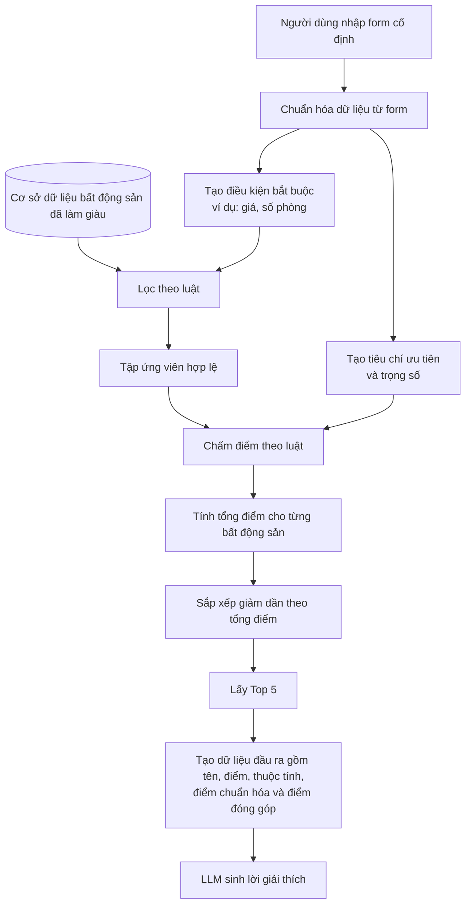
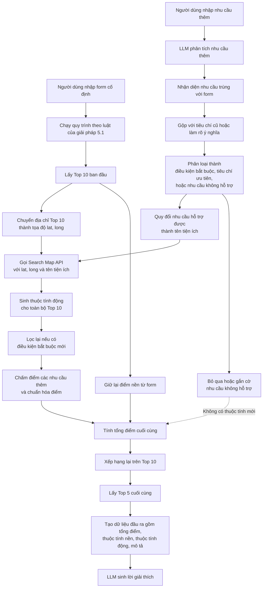

## Giải pháp 5.1

```mermaid
flowchart TD
	A[Người dùng nhập form cố định] --> B[Chuẩn hóa dữ liệu từ form]
	B --> C1[Tạo điều kiện bắt buộc<br/>ví dụ: giá, số phòng]
	B --> C2[Tạo tiêu chí ưu tiên<br/>và trọng số]
	DB[(Cơ sở dữ liệu bất động sản đã làm giàu)] --> D[Lọc theo luật]
	C1 --> D
	D --> E[Tập ứng viên hợp lệ]
	E --> F[Chấm điểm theo luật]
	C2 --> F
	F --> G[Tính tổng điểm cho từng bất động sản]
	G --> H[Sắp xếp giảm dần theo tổng điểm]
	H --> I[Lấy Top 5]
	I --> J[Tạo dữ liệu đầu ra gồm tên, điểm, thuộc tính,<br/>điểm chuẩn hóa và điểm đóng góp]
	J --> K[LLM sinh lời giải thích]
```

## Giải pháp 5.2

```mermaid
flowchart TD
	A[Người dùng nhập form cố định] --> B[Chạy quy trình theo luật của giải pháp 5.1]
	B --> C[Lấy Top 10 ban đầu]

	D[Người dùng nhập nhu cầu thêm] --> E[LLM phân tích nhu cầu thêm]
	E --> F[Nhận diện nhu cầu trùng với form]
	F --> G[Gộp với tiêu chí cũ hoặc làm rõ ý nghĩa]
	G --> H[Phân loại thành<br/>điều kiện bắt buộc, tiêu chí ưu tiên,<br/>hoặc nhu cầu không hỗ trợ]
	H --> I[Quy đổi nhu cầu hỗ trợ được<br/>thành tên tiện ích]
	H --> I1[Bỏ qua hoặc gắn cờ<br/>nhu cầu không hỗ trợ]

	C --> J[Chuyển địa chỉ Top 10 thành tọa độ lat, long]
	I --> K[Gọi Search Map API<br/>với lat, long và tên tiện ích]
	J --> K
	K --> L[Sinh thuộc tính động<br/>cho toàn bộ Top 10]
	L --> M[Lọc lại nếu có<br/>điều kiện bắt buộc mới]
	M --> N[Chấm điểm các nhu cầu thêm<br/>và chuẩn hóa điểm]
	C --> O[Giữ lại điểm nền từ form]
	N --> P[Tính tổng điểm cuối cùng]
	O --> P
	I1 -. Không có thuộc tính mới .-> P
	P --> Q[Xếp hạng lại trên Top 10]
	Q --> R[Lấy Top 5 cuối cùng]
	R --> S[Tạo dữ liệu đầu ra gồm tổng điểm,<br/>thuộc tính nền, thuộc tính động, mô tả]
	S --> T[LLM sinh lời giải thích]
```
