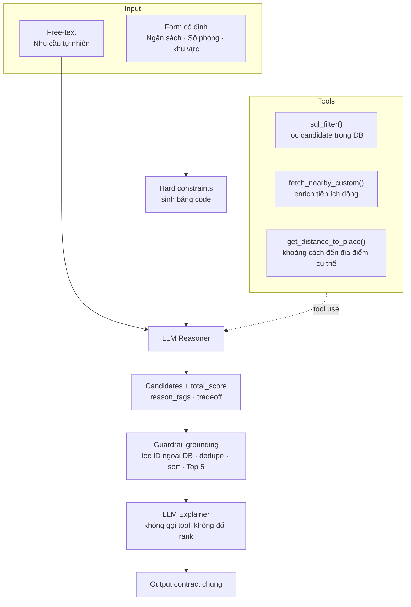
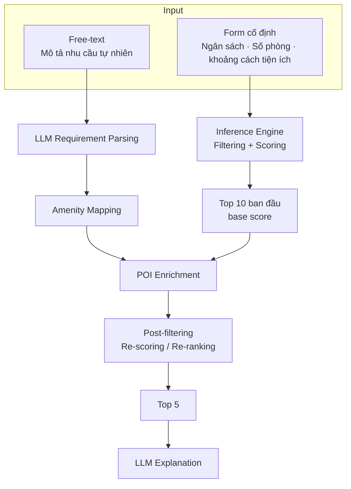

## Solution 1 — Form + Free-Text → Two-LLM Pipeline + Guardrail

**Điểm cốt lõi của Solution 1:**

- LLM reasoner được phép gọi tool nhưng bị giới hạn trong candidate set.
- Guardrail bằng code đảm bảo Top 5 luôn thuộc dataset.
- Enrichment động chỉ bổ sung thuộc tính cho candidate, không mở rộng tập bất động sản.
- LLM explainer chỉ diễn giải Top 5 đã được khóa.

---

## Solution 2 — Form + Free-Text → Inference Engine + LLM Enrichment → Top 5

