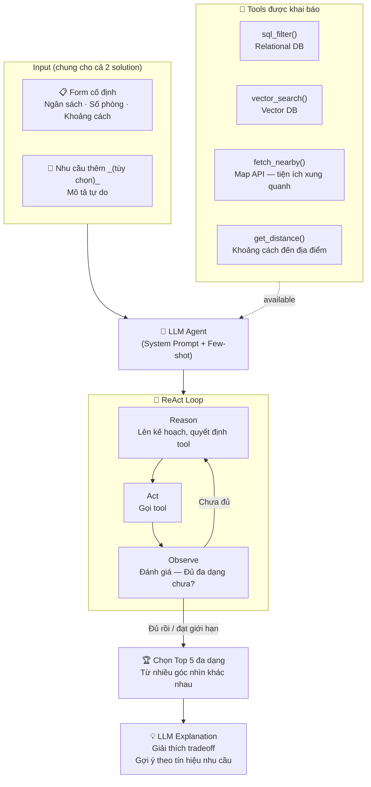
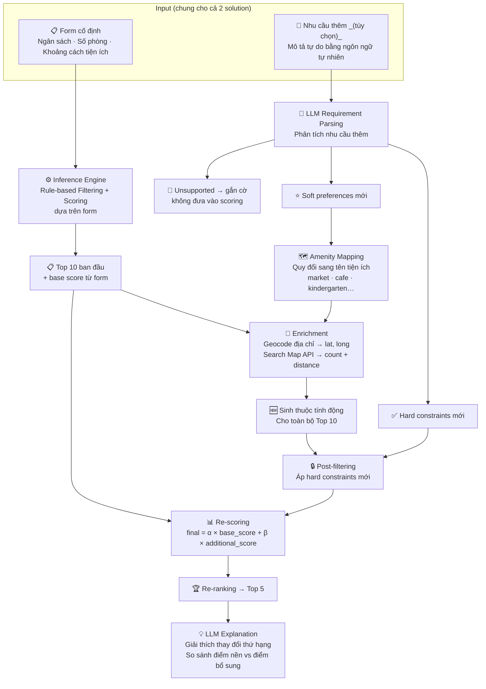

## Solution 1 — Form + Free-Text → LLM Agent (Tool Use) → Top 5 + Explanation

**Điểm cốt lõi của Solution 1:**
- LLM Agent tự quyết định chiến lược — không có pipeline cứng.
- Kết hợp linh hoạt nhiều tool: SQL filter, vector search, Map API, distance.
- Vòng lặp ReAct cho phép khám phá nhiều góc nhìn và dừng khi đã đủ đa dạng.
- Chất lượng suy luận được tinh chỉnh qua system prompt và few-shot examples.

---

## Solution 2 — Form + Free-Text → Inference Engine + LLM Enrichment → Top 5

**Điểm cốt lõi của Solution 2:**
- Inference Engine làm backbone — kết quả ổn định, dễ kiểm chứng và debug.
- LLM chỉ mở rộng tiêu chí, không thay thế engine → kiểm soát tốt hơn.
- Enrichment qua Map API cho phép đo lường chính xác các tiện ích xung quanh.
- Trọng số α, β kiểm soát mức ảnh hưởng giữa form gốc và nhu cầu thêm (khuyến nghị α=0.7, β=0.3).
- Phù hợp khi nhu cầu thêm có thể quy đổi thành amenity name cụ thể (chợ, café, trường mẫu giáo…).

