<!-- _class: lead cover -->
<!-- _paginate: false -->

# Hệ thống tư vấn chọn bất động sản thông minh
### Ứng dụng DSS with Data cho thị trường nhà ở TP.HCM

**Nhóm 8 — IT2041**
Trần Tú Quang · Tô Huỳnh Minh Tiến · Nguyễn Ấn · Nguyễn Văn Phú

 

University of Information Technology, VNU-HCM (UIT) · Tháng 7, 2026

<!--
NGƯỜI NÓI: TIẾN — 20 giây
- Chào thầy và các bạn, em là Tiến, đại diện nhóm 8.
- Đề tài của nhóm em là hệ thống tư vấn chọn bất động sản thông minh, ứng dụng cho thị trường nhà ở TP.HCM.
- Đây là bài toán DSS with Data: dữ liệu thật, tiêu chí đa chiều, và người dùng phải chấp nhận đánh đổi.
- Nhóm em có bốn bạn, mỗi bạn một phần, em xin bắt đầu.
-->

---

## Nội dung

1. **Bài toán** ra quyết định chọn bất động sản
2. **Dữ liệu**: thu thập, chuẩn hoá, làm giàu tiện ích
3. **Hai giải pháp**: Solution 1 và Solution 2
4. **Đánh giá**: validation set và rubric chung
5. **So sánh và kết luận**

<!--
NGƯỜI NÓI: TIẾN — 20 giây
- Bài của nhóm em đi theo năm phần: bài toán, dữ liệu, hai giải pháp, đánh giá, và so sánh kết luận.
- Trọng tâm ở phần ba: nhóm em xây song song hai giải pháp theo hai triết lý khác nhau rồi cho chạy đối đầu trên cùng dữ liệu.
- Em phụ trách phần một, bài toán. Ba bạn còn lại sẽ lần lượt trình bày các phần sau.
-->

---

<!-- _class: divider -->

1

# Bài toán

nhu cầu thật · tiêu chí đa chiều · đánh đổi

Phần 1

<!--
NGƯỜI NÓI: TIẾN — 8 giây (lướt nhanh, không dừng)
- Phần một, bài toán — vì sao chọn nhà cần tới một DSS chứ không phải chỉ là bộ lọc tìm kiếm.
-->

---

## Chọn nhà là bài toán ra quyết định đa tiêu chí

**Khó khăn của người mua**
- Hàng nghìn tin đăng, mô tả không chuẩn hoá
- Các tiêu chí xung đột nhau: giá rẻ, gần trung tâm, diện tích rộng
- Tiện ích xung quanh không có sẵn trong tin đăng

**Yêu cầu với hệ thống**
- Loại ứng viên vi phạm ràng buộc cứng
- Cân bằng tiêu chí mềm theo mức ưu tiên
- Giải thích được vì sao đề xuất

Mục tiêu: hệ thống hiểu được nhu cầu người dùng, kể cả khi diễn đạt bằng ngôn ngữ tự nhiên, nhưng vẫn giữ tính minh bạch và kiểm chứng được của một DSS.

<!--
NGƯỜI NÓI: TIẾN — 70 giây
- Thầy và các bạn thử hình dung mình đi mua nhà. Mở trang bất động sản lên là hàng nghìn tin đăng, mỗi tin mô tả một kiểu, không có chuẩn chung. Cái tin thì ghi diện tích lọt lòng, cái thì ghi diện tích xây dựng; cái ghi giá thương lượng, cái ghi giá cứng.
- Vấn đề thứ hai là các tiêu chí chọi nhau. Ai cũng muốn giá rẻ, gần trung tâm, diện tích rộng — nhưng thực tế được cái này thì mất cái kia. Căn rẻ mà rộng thì thường xa; căn gần trung tâm mà rẻ thì thường nhỏ. Người mua buộc phải đánh đổi, mà đánh đổi thì mỗi người một kiểu.
- Vấn đề thứ ba: cái người ta quan tâm nhất thì tin đăng gần như không ghi — gần trường con học không, gần chợ không, gần bệnh viện không. Muốn biết thì phải tự mở bản đồ dò từng căn một.
- Đây chính là lý do một bộ lọc tìm kiếm thông thường không đủ. Bộ lọc chỉ trả lời được "có hay không", còn người mua cần biết "căn nào tốt hơn, và tốt hơn ở chỗ nào".
- Nên hệ thống nhóm em muốn xây phải làm ba việc: loại thẳng những căn vi phạm ràng buộc cứng như vượt ngân sách; cân bằng các tiêu chí mềm theo mức ưu tiên của từng người; và quan trọng nhất là giải thích được vì sao gợi ý căn đó.
- Ý cuối là mâu thuẫn mà cả bài này xoay quanh: hệ thống phải hiểu được nhu cầu nói bằng ngôn ngữ tự nhiên, nhưng vẫn giữ được tính minh bạch và kiểm chứng được của một DSS.

[NẾU THIẾU GIỜ] bỏ ví dụ diện tích lọt lòng / diện tích xây dựng.
-->

---

## Input và Output

**Input**

`Form cố định`
- Ngân sách tối đa, số phòng ngủ tối thiểu (ràng buộc cứng)
- Trọng số ưu tiên cho trường học, công viên, siêu thị, bệnh viện, trục đường (tiêu chí mềm)

`Nhu cầu thêm` dạng free-text
- *"phải có chợ trong vòng 1km, ưu tiên gần trường mầm non"*

**Output**

- Top 5 bất động sản phù hợp nhất
- Điểm số kèm breakdown từng tiêu chí
- Giải thích bằng tiếng Việt
- Danh sách nhu cầu chưa hỗ trợ, có gắn cờ

form + free-text → Top 5 + explanation

<!--
NGƯỜI NÓI: TIẾN — 75 giây
- Đây là những gì hệ thống nhận vào và trả ra. Cả hai giải pháp của nhóm em dùng chung đúng hợp đồng này, nên lát nữa mới so sánh được.
- Input có hai phần. Thứ nhất là form cố định. Ngân sách tối đa và số phòng ngủ tối thiểu là ràng buộc cứng — không thoả là loại, không có ngoại lệ. Còn trọng số ưu tiên cho trường học, công viên, siêu thị, bệnh viện, trục đường là tiêu chí mềm — người dùng tự kéo, ai coi trọng trường học thì kéo trường lên cao.
- Chỗ này quan trọng: hệ thống không áp đặt bộ trọng số chung cho mọi người. Gia đình có con nhỏ và một bạn trẻ độc thân sẽ ưu tiên hoàn toàn khác nhau, nên trọng số phải do người dùng khai.
- Phần thứ hai mới là điểm thú vị: ô nhu cầu thêm, gõ tự do. Ví dụ như trên slide — "phải có chợ trong vòng 1 km, ưu tiên gần trường mầm non". Dù form có thiết kế kỹ tới đâu thì cũng không bao giờ phủ hết nhu cầu thật của người ta, nên nhóm em để một ô mở.
- Về output: Top 5 căn phù hợp nhất, kèm điểm số có breakdown từng tiêu chí để người dùng biết điểm đó từ đâu ra chứ không phải một con số từ trên trời rơi xuống, một đoạn giải thích bằng tiếng Việt, và một danh sách những nhu cầu hệ thống chưa hỗ trợ được, có gắn cờ rõ ràng.
- Ý cuối cùng đó nhóm em coi là một tính năng chứ không phải thiếu sót — lát nữa bạn Ấn sẽ nói kỹ vì sao.
- Em xin mời bạn Phú trình bày phần dữ liệu.

[NẾU THIẾU GIỜ] bỏ ý "gia đình có con nhỏ và bạn trẻ độc thân".
-->

---

<!-- _class: divider -->

2

# Dữ liệu

thu thập · chuẩn hoá · làm giàu thông tin

Phần 2

<!--
NGƯỜI NÓI: PHÚ — 8 giây (lướt nhanh)
- Em là Phú. Em xin trình bày phần hai, dữ liệu — bước biến tin đăng thô thành thứ máy chấm điểm được.
-->

---

## Dataset và làm giàu thông tin

**Dữ liệu bất động sản**
- 100 listings: 50 Gò Vấp và 50 Tân Bình
- Nguồn: tin đăng thật, thị trường TP.HCM 2025
- Chuẩn hoá schema: `property_id`, giá, diện tích, phòng ngủ, `lat/lon`
- Lọc chất lượng: có toạ độ, giá và diện tích hợp lệ

**Làm giàu thông tin tiện ích (POI)**
- Gọi OpenStreetMap Overpass API và Geoapify
- Sinh 2 nhóm đặc trưng cho mỗi bất động sản:
  - `distance_to_nearest_*_m`
  - `near_*_count_1km`
- 7 nhóm tiện ích: trường, công viên, bệnh viện, siêu thị, chợ, cà phê, trục đường

Bước này biến tin đăng thô thành decision matrix chấm điểm được, dùng chung cho cả hai giải pháp.

<!--
NGƯỜI NÓI: PHÚ — 60 giây
- Bên trái là dữ liệu gốc: 100 tin đăng thật, 50 căn Gò Vấp và 50 căn Tân Bình, thị trường TP.HCM 2025.
- Chỉ hai quận vì nhóm em ưu tiên dữ liệu sạch, kiểm chứng được hơn là lấy nhiều mà nhiễu. Mọi tin đều chuẩn hoá về một schema chung, trong đó toạ độ lat/lon là bắt buộc — không có toạ độ thì không tính được khoảng cách.
- Bên phải là phần tốn công nhất: làm giàu thông tin tiện ích. Tin đăng không ghi gần trường hay gần chợ nên nhóm em phải tự đi lấy, qua Overpass API của OpenStreetMap và Geoapify.
- Mỗi căn sinh ra hai nhóm đặc trưng: khoảng cách tới tiện ích gần nhất, và số tiện ích trong bán kính 1 km. Làm cho 7 nhóm: trường, công viên, bệnh viện, siêu thị, chợ, cà phê, trục đường.
- Nhóm em đối chiếu chéo hai nguồn để chắc dữ liệu đúng — ví dụ căn GV_001, Geoapify báo 218 mét tới trường, Overpass báo 219 mét, lệch 1 mét.
- Kết quả là một ma trận quyết định số hoá. Điểm quan trọng: cả hai giải pháp phía sau chạy trên đúng bộ dữ liệu này, nên so sánh mới công bằng.

[NẾU THIẾU GIỜ] bỏ ý đối chiếu chéo GV_001.
-->

---

<!-- _class: divider -->

3

# Hai giải pháp

LLM-driven · Rule-driven

Phần 3

<!--
NGƯỜI NÓI: PHÚ — 8 giây (lướt nhanh)
- Sang phần ba, phần chính của đề tài.
- Nhóm em không chọn sẵn một hướng, mà xây hẳn hai giải pháp theo hai triết lý khác nhau rồi cho chạy đối đầu.
-->

---

## Hai hướng tiếp cận cho cùng một bài toán

Cả hai nhận cùng input, trả cùng output contract, chạy trên cùng dataset và cùng validation set. Khác nhau ở **nơi ra quyết định thứ hạng**.

**Solution 1** · Sequential 2-LLM

LLM #1: Reasoner

▼

Guardrail

▼

LLM #2: Explainer

**Solution 2** · Hybrid Form + Free-text

Parser

▼

Rule-based: lọc & chấm điểm

▼

Explainer

<b>LLM</b> chấm điểm và xếp hạng

<b>Rule-based</b> xếp hạng, parser chỉ dịch nhu cầu

<!--
NGƯỜI NÓI: PHÚ — 55 giây
- Khung chung trước: hai giải pháp nhận cùng input, trả cùng output contract, chạy cùng dataset 100 căn, chấm bằng cùng bộ validation.
- Mọi thứ xung quanh giống nhau. Khác đúng một chỗ, mà là chỗ quan trọng nhất: ai quyết định thứ hạng.
- Bên trái, Solution 1 do em làm, là pipeline tuần tự hai LLM. LLM thứ nhất là Reasoner — đọc nhu cầu, gọi tool lấy dữ liệu, tự chấm điểm và xếp hạng. Qua lớp guardrail kiểm tra, rồi LLM thứ hai viết giải thích. Ở đây LLM là người ra quyết định.
- Bên phải, Solution 2 của bạn Quang, là hướng lai. Parser dịch nhu cầu tự do ra tiêu chí máy hiểu được, nhưng lọc và chấm điểm hoàn toàn bằng luật. LLM chỉ dịch, không được quyết.
- Tức là một bên tin vào khả năng suy luận của mô hình, một bên tin vào công thức tường minh — đánh đổi kinh điển của DSS giữa linh hoạt và giải thích được.
-->

---

<!-- _class: tight -->

## Solution 1: Sequential 2-LLM Pipeline

**LLM #1: Reasoner**
- Tool-calling giới hạn 5 lượt, không phải agent tự trị
- Tools: `sql_filter` (PostgreSQL), `fetch_nearby_custom`, `get_distance_to_place` (Mapbox)
- Chấm điểm theo rubric và few-shot trong prompt

**Guardrail**
- Lọc grounding, loại thông tin LLM không lấy từ dữ liệu

**LLM #2: Explainer**
- Sinh giải thích tiếng Việt cho Top 5

**Hạ tầng**
- OpenRouter, xoay nhiều key và fallback nhiều model
- Short-circuit khi form lọc ra rỗng, không tốn quota
- Degrade `status="error"` thay vì sập cả batch

Điểm mạnh: hiểu ngôn ngữ tự nhiên tốt, kể cả tiếng Việt không dấu, linh hoạt với mọi loại tiện ích nhờ gọi API thật.

<!--
NGƯỜI NÓI: PHÚ — 75 giây
- Solution 1 có ba khối.
- LLM số một, Reasoner, được cấp ba tool: sql_filter truy vấn PostgreSQL lọc theo ngân sách và phòng ngủ; fetch_nearby_custom tìm tiện ích quanh một căn; get_distance_to_place đo khoảng cách thật qua Mapbox.
- Chỗ này em muốn nhấn: em giới hạn tối đa 5 lượt gọi tool. Đây không phải agent tự trị chạy vô hạn — giới hạn cứng để kiểm soát chi phí, thời gian, và giữ hành vi dự đoán được.
- Chấm điểm thì em đưa rubric và vài ví dụ mẫu vào thẳng prompt, để mô hình chấm theo khung của mình chứ không tự nghĩ ra thang điểm riêng.
- Khối hai là guardrail, em thấy bắt buộc phải có khi dùng LLM. Nó rà output, cái gì mô hình nói mà không truy được về dữ liệu thật thì loại — chặn mô hình bịa, ví dụ tự nhận căn này gần trường mà không có số liệu chống lưng.
- Khối ba, LLM số hai, chỉ viết giải thích tiếng Việt cho Top 5. Tách riêng vì suy luận và diễn đạt là hai việc khác nhau, gộp lại thì cả hai đều kém.
- Hạ tầng thì em dùng OpenRouter, xoay nhiều key và fallback nhiều model vì xài model free hay hết quota. Form lọc ra rỗng thì short-circuit không gọi LLM; một case lỗi thì trả status error riêng case đó, không làm sập cả batch.
- Điểm mạnh lớn nhất là hiểu ngôn ngữ — tiếng Việt không dấu, viết tắt vẫn hiểu; và vì gọi API thật nên hỏi tiện ích gì cũng đo được, không bó vào 7 nhóm enrich sẵn.
- Hạn chế em xin để phần so sánh cuối. Em mời bạn Quang.

[NẾU THIẾU GIỜ] gộp 2 ý hạ tầng thành một câu "em có cơ chế fallback và degrade để batch không sập".
-->

---

## Solution 2: Hybrid Form + Free-text

Ngôn ngữ tự nhiên không thay thế inference engine, mà mở rộng phạm vi tiêu chí hệ thống hiểu và đo được. Rule-based vẫn là nơi ra quyết định.

Mỗi mệnh đề free-text được quy về 1 trong 4 nhóm, theo nguyên tắc capability-aware:

| Nhóm | Vai trò | Ví dụ |
|---|---|---|
| `hard` | Bắt buộc, dùng để loại ứng viên | *"phải có chợ trong vòng 1km"* |
| `soft` | Ưu tiên, dùng để chấm điểm bổ sung | *"ưu tiên gần trường mầm non"* |
| `duplicates` | Đã có trong form, hợp nhất để không đếm 2 lần | *"gần siêu thị"* |
| `unsupported` | Không đo được, gắn cờ và không chấm | *"hợp phong thủy"* |

Chỉ giữ nhu cầu quy đổi được sang <code>amenity name</code> mà tool đo được: <i>"càng nhiều chợ càng tốt"</i> → <code>market</code> → <code>nearby_market_count_within_1000m</code>

<!--
NGƯỜI NÓI: QUANG — 65 giây
- Em là Quang, em phụ trách Solution 2.
- Triết lý gói trong câu trên slide: ngôn ngữ tự nhiên không thay thế inference engine, nó chỉ mở rộng phạm vi tiêu chí hệ thống hiểu và đo được. Nơi ra quyết định vẫn là rule-based.
- Lý do là em muốn giữ tính tái lập — cùng input phải ra cùng output, lần nào cũng vậy. Với DSS em cho đó là yêu cầu bắt buộc.
- Vậy free-text xử lý thế nào: em tách ra từng mệnh đề, mỗi mệnh đề rơi vào đúng một trong bốn nhóm này.
- Hard là bắt buộc — "phải có chợ trong vòng 1 km", không thoả là loại thẳng. Soft là ưu tiên — "ưu tiên gần trường mầm non", không loại ai, chỉ cộng điểm.
- Duplicates là nhu cầu đã có sẵn trong form. Người dùng gõ "gần siêu thị" trong khi form đã có trọng số siêu thị — phải hợp nhất, không thì tiêu chí bị tính hai lần.
- Unsupported là thứ không đo được như "hợp phong thuỷ" — gắn cờ, không chấm điểm.
- Nguyên tắc em gọi là capability-aware: chỉ giữ nhu cầu quy đổi được về một tên tiện ích mà tool đo được, như ví dụ dưới slide. Không quy đổi được thì em không đoán bừa mà đẩy sang unsupported — thà nói thẳng là chưa hỗ trợ còn hơn bịa một điểm số không có cơ sở.
-->

---

## Solution 2: Pipeline

Lấy Top 10 làm vùng đệm trước khi re-rank. Một bất động sản hạng 6 theo form có thể lên hạng 1 sau khi xét nhu cầu thêm, nên cắt Top 5 quá sớm sẽ mất ứng viên tốt.

<!--
NGƯỜI NÓI: QUANG — 40 giây
- Đây là pipeline của Solution 2, em đi nhanh.
- Nhận form và free-text, parser dịch free-text ra bốn nhóm vừa nói. Lọc cứng: áp ràng buộc form cộng các mệnh đề hard, vi phạm là loại, không có chuyện điểm cao thì được châm chước. Rồi chấm điểm cơ bản theo trọng số form, ra base score.
- Chi tiết em muốn nhấn ở dòng chú thích dưới slide: em không cắt Top 5 ngay mà lấy Top 10 làm vùng đệm. Vì thứ hạng theo form chưa phải thứ hạng cuối — một căn hạng 6 mà thoả rất tốt nhu cầu thêm hoàn toàn có thể lên hạng 1 sau re-rank. Cắt sớm là mất nó, không lấy lại được.
- Top 10 này được enrich, re-rank, cắt Top 5 cuối, rồi sinh giải thích. Slide sau em nói kỹ bước re-rank vì đó là phần lõi.
-->

---

## Solution 2: Re-ranking

**Enrichment bằng Overpass API**
- Dữ liệu tiện ích thật từ OpenStreetMap, phủ cả 2 quận
- Sinh cùng tập thuộc tính cho cả Top 10 để so sánh đồng nhất
- Cache xuống đĩa nên tái lập được, chạy lại không tốn network

**Công thức kết hợp**

$$ \text{final} = \alpha \cdot \text{base} + \beta \cdot \text{additional} $$

$\alpha=0.7$ · $\beta=0.3$ · $\alpha+\beta=1$

- `base` (X): điểm từ form
- `additional` (Y): điểm từ nhu cầu thêm

Form vẫn chi phối phần lớn quyết định với $\alpha=0.7$, nhu cầu thêm chỉ đóng vai trò tinh chỉnh. Tránh để một câu nói tự do lật đổ toàn bộ tiêu chí đã khai báo.

<!--
NGƯỜI NÓI: QUANG — 55 giây
- Bước re-rank có hai phần: lấy dữ liệu và kết hợp điểm.
- Bên trái, em gọi Overpass API lấy dữ liệu tiện ích thật. Điểm em chú ý là phải sinh cùng một tập thuộc tính cho cả 10 căn — nếu căn này có dữ liệu chợ mà căn kia không thì so sánh khập khiễng.
- Kết quả em cache xuống đĩa, vừa đỡ tốn network vừa đảm bảo tái lập: tuần sau chạy lại vẫn ra đúng kết quả, không phụ thuộc lúc đó API trả gì.
- Bên phải là công thức: điểm cuối bằng alpha nhân base cộng beta nhân additional — base là điểm từ form, additional là điểm từ nhu cầu thêm.
- Em chọn alpha 0.7, beta 0.3. Lý do ở khung dưới: form là chỗ người dùng khai báo có ý thức, ngồi kéo từng thanh trọng số; còn free-text là một câu gõ vội. Em không muốn một câu gõ vội lật đổ toàn bộ tiêu chí người ta đã cân nhắc kỹ.
- Em xin nói thật là bộ số 0.7 và 0.3 hiện chọn theo suy luận thiết kế, chưa tối ưu bằng thực nghiệm — đây là hướng nhóm em muốn làm tiếp.
-->

---

<!-- _class: divider -->

4

# Đánh giá

validation set · output contract · rubric

Phần 4

<!--
NGƯỜI NÓI: QUANG — 8 giây (lướt nhanh)
- Sang phần bốn, đánh giá.
- Vừa rồi là hai giải pháp rất khác nhau. Câu hỏi tiếp theo là: làm sao so sánh cho công bằng. Em xin nói phần nền, rồi bạn Ấn sẽ trình bày cách chấm và kết quả.
-->

---

## Nền tảng để so sánh công bằng

**Output contract chung**

Hai solution bắt buộc trả cùng schema:

case_id · solution_id · status
top5[ rank, property_id,
      total_score,
      hard_constraint_pass ]
explanation_summary
unsupported_requirements
latency_ms

Được phép thêm field riêng như `base_score` hay `tool_calls_summary`, nhưng không được thiếu field bắt buộc.

**Validation set dùng chung: 10 case**

| Nhóm case | Mục đích |
|---|---|
| `clear` | Nhu cầu rõ ràng, baseline |
| `ambiguous_free_text` | Nhu cầu mơ hồ |
| `conflict_tradeoff` | Tiêu chí xung đột |
| `unsupported` | Nhu cầu không đo được |

Cùng 1 dataset và cùng 1 bộ case, nên khác biệt kết quả phản ánh đúng khác biệt giải pháp.

<!--
NGƯỜI NÓI: QUANG — 50 giây
- Để so sánh được, nhóm em phải cố định hai thứ trước.
- Thứ nhất là output contract chung: hai giải pháp bắt buộc trả cùng một schema — mã case, trạng thái, Top 5 kèm thứ hạng và tổng điểm, cờ thoả ràng buộc cứng, giải thích, danh sách nhu cầu chưa hỗ trợ, và độ trễ.
- Mỗi bên được thêm field riêng — bên em có base_score, bên bạn Phú có tóm tắt các lượt gọi tool — nhưng không được thiếu field bắt buộc. Nhờ vậy nhóm em chấm được bằng một script chung cho cả hai, không phải chấm tay, không bị thiên vị.
- Thứ hai là bộ validation dùng chung 10 case, chia bốn nhóm có chủ đích: clear là baseline; ambiguous free-text là nhu cầu mơ hồ; conflict tradeoff là tiêu chí chọi nhau như vừa muốn rẻ vừa muốn gần trung tâm; và unsupported là nhu cầu cố tình không đo được, để bẫy xem hệ thống có trung thực không.
- Cùng dataset, cùng bộ case — nên kết quả hai bên khác nhau thì đúng là khác biệt do giải pháp, chứ không phải do đề bài khác.
- Em xin mời bạn Ấn.
-->

---

## Rubric chấm điểm

**Metric định lượng**

| Metric | Ý nghĩa |
|---|---|
| `CSR` | Top 5 có thoả ràng buộc cứng |
| `Precision@5`, `Recall@5` | Độ liên quan của Top 5 |
| `NDCG@5`, `MAP` | Chất lượng thứ hạng |
| `Latency_ms` | Tốc độ |

**Cách chấm nhu cầu `unsupported`**

| Tình huống | Kết luận |
|---|---|
| Không đo được, gắn cờ rõ ràng | Đạt |
| Không đo được nhưng vẫn chấm điểm | Lỗi nặng |
| Đo được nhưng không đưa vào output | Lỗi vừa |

Hệ thống phải nói rõ giới hạn của mình. Gắn cờ "chưa hỗ trợ" tốt hơn là bịa điểm số cho tiêu chí không đo được.

<!--
NGƯỜI NÓI: ẤN — 45 giây
- Em là Ấn, em phụ trách phần chấm điểm và kết luận. Rubric gồm hai phần.
- Bên trái là metric định lượng. CSR là tỉ lệ căn trong Top 5 thực sự thoả ràng buộc cứng — em coi đây là điều kiện cần, vì gợi ý một căn vượt ngân sách thì điểm cao cũng vô nghĩa.
- Precision@5 và Recall@5 đo độ liên quan. NDCG@5 và MAP khắt khe hơn vì xét cả thứ tự — xếp căn tốt nhất lên đầu được điểm cao hơn là để nó ở cuối.
- Bên phải là phần em nghĩ đặc thù nhất của bài này: chấm cách hệ thống xử lý nhu cầu không đo được.
- Không đo được mà gắn cờ rõ ràng — em cho đạt. Không đo được nhưng vẫn chấm điểm, tự tin đưa vào kết quả — lỗi nặng, vì hệ thống bịa số mà người dùng lại tin theo để mua nhà. Còn đo được nhưng bỏ quên không đưa vào output thì là lỗi vừa.
- Ý chính: một DSS tốt phải nói rõ giới hạn của chính nó. Nói "cái này chưa đo được" tốt hơn bịa một con số nghe có vẻ hợp lý.
-->

---

<!-- _class: tight -->

## Kết quả trên validation set chung

**Mức đồng thuận trên 10 case chạy chung**

| Chỉ số | Kết quả |
|---|---|
| Cùng Top 1 | **8/10** |
| Top 5 trùng trung bình | **4.0/5** |
| Trùng hoàn toàn (5/5) | 5 case |

**Solution 2 trên 13 case**

| Chỉ số | Kết quả |
|---|---|
| Case chạy thành công | 13/13 |
| `hard_constraint_pass` | 65/65 |
| Gắn cờ `unsupported` | 10/13 |

Hai bên lệch nhau đúng ở các case có nhu cầu thêm **đo được** (`V1_006`–`V1_008`, `V1_010`). Các case free-text chỉ nhắc lại tiêu chí đã có trong form thì cho kết quả gần như trùng khớp.

Phần nền rule-based nhất quán giữa hai solution; khác biệt xuất hiện đúng chỗ hai bên xử lý nhu cầu thêm theo cách khác nhau. Solution 1 hiện mới chạy 10/13 case.

<!--
NGƯỜI NÓI: ẤN — 55 giây
- Bên trái là mức đồng thuận giữa hai giải pháp trên 10 case chung: cùng Top 1 ở 8 trên 10 case, Top 5 trùng trung bình 4 trên 5 căn, và 5 case trùng khớp hoàn toàn.
- Con số này đáng chú ý vì hai giải pháp có kiến trúc hoàn toàn khác nhau — một bên LLM tự chấm, một bên công thức tường minh. Trùng nhau nhiều như vậy nghĩa là phần nền dữ liệu và tiêu chí đã đủ chắc để cả hai hội tụ.
- Bên phải là Solution 2 trên bộ mở rộng 13 case: chạy thành công 13 trên 13, và hard_constraint_pass đạt 65 trên 65 — toàn bộ căn được gợi ý đều thoả ràng buộc cứng, không lọt căn nào.
- Điểm em muốn nhấn nhất ở khung dưới: hai bên lệch không lung tung mà lệch đúng chỗ — bốn case V1_006 đến V1_008 và V1_010, đều là case có nhu cầu thêm đo được thật. Còn case nào free-text chỉ nhắc lại tiêu chí đã có trong form thì hai bên gần như trùng khớp. Đó là dấu hiệu phép so sánh này lành mạnh, không phải nhiễu ngẫu nhiên.
- Em cũng xin nói rõ một hạn chế: Solution 1 mới chạy được 10 trên 13 case do quota của model free, nên con số so sánh lấy trên 10 case chung.
-->

---

<!-- _class: divider -->

5

# So sánh và kết luận

điểm mạnh · hạn chế · hướng đi

Phần 5

<!--
NGƯỜI NÓI: ẤN — 5 giây (lướt nhanh)
- Phần cuối, em xin đặt hai giải pháp cạnh nhau và rút ra kết luận.
-->

---

<!-- _class: tight -->

## Solution 1 và Solution 2

| Tiêu chí | Solution 1 (2-LLM) | Solution 2 (Hybrid) |
|---|---|---|
| Nơi ra quyết định | LLM chấm điểm, xếp hạng | Rule-based xếp hạng |
| Hiểu ngôn ngữ tự nhiên | Tốt, kể cả không dấu | Theo từ khoá, có giới hạn |
| Chất lượng giải thích | **Như tư vấn viên thật**, có bảng trade-off | Theo template, khô hơn |
| Tính tái lập | Lệch giữa các lần chạy | Cùng input, cùng output |
| Tuân thủ ràng buộc cứng | Có case lọt ứng viên trượt | `hard_pass` 65/65 |
| Tốc độ (trung bình/case) | **~239 s** | **~15 s** |
| Phụ thuộc ngoài | OpenRouter, Map API, PostgreSQL | Overpass API (có cache) |

Hai hướng bổ sung cho nhau: Solution 1 mạnh ở khả năng hiểu, Solution 2 mạnh ở minh bạch và ổn định. Đây là đánh đổi quen thuộc của DSS giữa linh hoạt và giải thích được.

<!--
NGƯỜI NÓI: ẤN — 75 giây
- Bảng này em đi từ trên xuống. Dòng đầu là gốc rễ của mọi khác biệt còn lại: Solution 1 để LLM xếp hạng, Solution 2 để rule-based xếp hạng.
- Hai dòng tiếp là chỗ Solution 1 mạnh. Hiểu ngôn ngữ tự nhiên: người dùng gõ tiếng Việt không dấu, viết tắt, diễn đạt lòng vòng, mô hình vẫn hiểu; Solution 2 bắt theo từ khoá nên gặp cách diễn đạt lạ là chịu.
- Chất lượng giải thích là chỗ Solution 1 vượt trội nhất — nó viết đúng kiểu một tư vấn viên thật, còn tự lập bảng đánh đổi. Solution 2 theo template, đúng và đủ nhưng khô.
- Ba dòng sau là chỗ Solution 2 mạnh. Tính tái lập: Solution 1 chạy hai lần có thể lệch nhau vì mô hình sinh vốn ngẫu nhiên; Solution 2 cùng input là cùng output. Với hệ thống người ta dựa vào để mua nhà thì em cho đây là điểm rất nặng ký.
- Tuân thủ ràng buộc cứng: Solution 1 có case lọt căn không đạt vào Top 5 — lỗi nghiêm trọng vì ràng buộc cứng đáng lẽ tuyệt đối. Solution 2 đạt 65 trên 65 vì lọc bằng luật chứ không nhờ mô hình tự giác.
- Tốc độ chênh rất lớn: 239 giây so với 15 giây một case, gấp khoảng 16 lần, do Solution 1 phải gọi LLM nhiều lượt cộng gọi tool bên ngoài.
- Kết luận ở khung dưới: không bên nào thắng tuyệt đối. Solution 1 mạnh ở khả năng hiểu, Solution 2 mạnh ở minh bạch và ổn định — đúng là đánh đổi kinh điển của DSS, và qua bài này nhóm em đo được nó bằng số cụ thể chứ không chỉ nói lý thuyết.

[NẾU THIẾU GIỜ] bỏ dòng "phụ thuộc ngoài", chỉ nói 6 dòng còn lại.
-->

---

## Hạn chế và hướng phát triển

**Hạn chế hiện tại**
- Dataset mới ở quy mô 100 listings, 2 quận
- Ground truth của validation set do nhóm tự dựng, chưa có khảo sát người mua thật
- Solution 1 phụ thuộc quota và độ ổn định của model free
- Solution 2 hiểu free-text theo từ khoá nên có giới hạn

**Hướng phát triển**
- Mở rộng dữ liệu ra nhiều quận, tăng số listings
- Thu thập nhãn relevance từ người dùng thật để có ground truth khách quan
- Kết hợp hai hướng: LLM dịch nhu cầu, rule-based xếp hạng
- Xây giao diện web và bản đồ trực quan

<!--
NGƯỜI NÓI: ẤN — 50 giây
- Nhóm em xin nói thẳng các hạn chế.
- Dữ liệu mới ở quy mô 100 listing và 2 quận — đủ chứng minh phương pháp chạy được, chưa đủ để nói dùng được cho cả thành phố.
- Hạn chế nhóm em thấy nặng nhất: ground truth của bộ validation do chính nhóm em dựng. Tức là vừa xây hệ thống vừa tự ra đề chấm, dù cố khách quan vẫn có nguy cơ thiên vị, và chưa khảo sát người mua nhà thật.
- Ngoài ra Solution 1 phụ thuộc quota model free, còn Solution 2 hiểu free-text theo từ khoá nên có giới hạn.
- Hướng phát triển tương ứng: mở rộng dữ liệu ra nhiều quận, và thu thập nhãn relevance từ người dùng thật để có ground truth khách quan.
- Hướng nhóm em tâm đắc nhất là kết hợp hai giải pháp: dùng LLM ở phần nó mạnh nhất là dịch nhu cầu tự nhiên ra tiêu chí đo được, rồi giao việc xếp hạng cho rule-based để giữ minh bạch và tái lập — lấy khả năng hiểu của Solution 1 ghép vào bộ máy quyết định của Solution 2.
- Cuối cùng là xây giao diện web có bản đồ trực quan.
-->

---

<!-- _class: lead -->

# Q&A

### Cảm ơn thầy và các bạn đã lắng nghe

 

**Nhóm 8 · IT2041**

<!--
NGƯỜI NÓI: ẤN chốt, CẢ NHÓM trả lời Q&A — 15 giây
- Tóm lại một câu: nhóm em xây hai hệ thống tư vấn chọn nhà theo hai triết lý khác nhau, cho chạy trên cùng dữ liệu và cùng bộ đánh giá, và đo được đánh đổi giữa khả năng hiểu ngôn ngữ và tính minh bạch bằng số cụ thể.
- Nhóm em cảm ơn thầy và các bạn đã lắng nghe, và xin sẵn sàng nhận câu hỏi.
- PHÂN CÔNG TRẢ LỜI: hỏi về dữ liệu và enrich → Tiến. Hỏi về Solution 1, LLM, guardrail → Phú. Hỏi về Solution 2, công thức, trọng số → Quang. Hỏi về validation, metric, ground truth → Ấn.
-->
